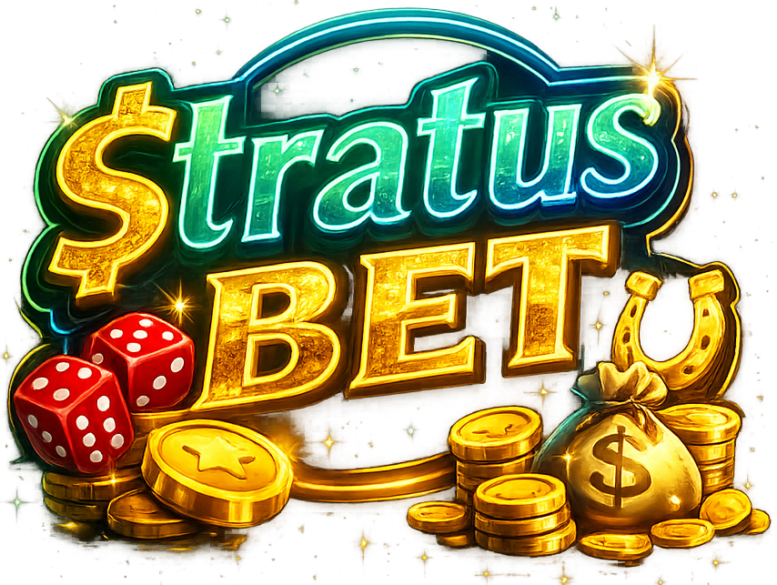

# 🎰 StratusBet - Campanha Educativa CIPA

<p align="center">
    
</p>

---

# 📖 Sobre o Projeto

O **StratusBet** é um jogo educativo desenvolvido para uma campanha da **CIPA**, com o objetivo de conscientizar colaboradores sobre os riscos das apostas online, do vício em jogos de azar e seus impactos na saúde mental.

O projeto simula o funcionamento de plataformas de apostas utilizando mecanismos psicológicos semelhantes aos encontrados em cassinos virtuais, conduzindo o jogador a uma perda inevitável para promover reflexão e conscientização.

---

# 🎯 Objetivos

- Demonstrar como plataformas de apostas utilizam mecanismos de recompensa para manter o jogador engajado;
- Simular o efeito psicológico do **"quase ganhou"**;
- Mostrar o impacto emocional da perda total;
- Incentivar a reflexão sobre o vício em apostas;
- Coletar apenas métricas estatísticas anônimas para avaliação da campanha da CIPA.

---

# ⭐ Características

- 🎮 Jogo interativo
- 📊 Dashboard em tempo real
- ☁️ Firebase Firestore
- 📱 Responsivo (Mobile First)
- 🔄 Atualização em tempo real
- 📈 Gráficos estatísticos
- 🔒 Dados anônimos
- ⚖️ Desenvolvido considerando os princípios da LGPD
- 🌐 Hospedado no GitHub Pages
- 🚀 Deploy automatizado com GitHub Actions

---

# 🛠 Tecnologias Utilizadas

- HTML5
- CSS3
- JavaScript (ES6 Modules)
- Firebase Firestore
- Chart.js
- GitHub Pages
- GitHub Actions

---

# 🏗 Arquitetura do Projeto

```text
               QR Code
                  │
                  ▼
          GitHub Pages
                  │
                  ▼
        Jogo (HTML/CSS/JS)
                  │
                  ▼
         Firebase Firestore
                  │
                  ▼
 Dashboard em Tempo Real
```

---

# 🚀 Funcionalidades

## 🎮 Jogo

- Crédito inicial de 100 moedas;
- Sistema de rodadas;
- Ganhos aleatórios;
- Jackpots;
- Quase vitória ("Near Miss");
- Derrotas;
- Game Over;
- Tela Final educativa;
- Tela "Jogar Novamente";
- Sons e efeitos sonoros;
- Vibração em dispositivos móveis;
- Confetes em grandes vitórias;
- Interface totalmente responsiva.

---

## 📊 Dashboard Administrativo

O projeto possui um painel administrativo com atualização em tempo real.

### Resumo Geral

- 👥 Jogadores únicos
- 👁️ Total de acessos
- 🎮 Partidas realizadas

### Resultados

- 💰 Ganhos
- 💸 Derrotas
- 🏆 Jackpots

### Engajamento

- ☠️ Game Over
- 🔁 Jogar Novamente
- 🏁 Tela Final
- 🎯 Sexta Rodada

### Indicadores

- Média de partidas por jogador
- Taxa de vitória
- Taxa de Jackpot
- Taxa de Game Over
- Conversão para Tela Final

### Ranking

Top 3 jogadores com maior número de:

- acessos;
- reinícios do jogo.

### Recursos

- Atualização em tempo real;
- Gráficos com Chart.js;
- Limpeza do banco de dados.

---

# ☁️ Firebase

O projeto utiliza o **Firebase Firestore** como banco de dados em tempo real.

São armazenadas apenas informações estatísticas anônimas referentes ao funcionamento do jogo.

## Estrutura do banco

### Coleção

```
estatisticas
```

Documento

```
jogo
```

### Coleção

```
jogadores
```

Cada jogador possui um documento contendo apenas informações estatísticas:

- acessos
- partidas
- ganhos
- derrotas
- jackpots
- gameOver
- jogarNovamente
- telaFinal
- sextaRodada
- primeiraVisita
- ultimaVisita

Nenhum dado pessoal é armazenado.

---

# 🔒 Privacidade e Proteção de Dados (LGPD)

O projeto foi desenvolvido considerando os princípios da **Lei Geral de Proteção de Dados (LGPD - Lei nº 13.709/2018)**.

## Dados pessoais

O sistema **não coleta nem armazena dados pessoais**.

Não são registrados:

- Nome;
- CPF;
- Matrícula;
- E-mail;
- Telefone;
- Endereço IP;
- Localização;
- Cookies de identificação;
- Dados sensíveis.

Todo o monitoramento da campanha é realizado utilizando apenas **dados estatísticos anônimos**.

---

## Identificação do jogador

Cada visitante recebe um identificador aleatório (**UUID**) gerado localmente pelo navegador.

Esse identificador:

- não possui relação com a identidade do participante;
- não permite identificar uma pessoa física;
- não é compartilhado com terceiros;
- é utilizado exclusivamente para contabilizar estatísticas da campanha.

---

## Session Storage

O projeto utiliza o **Session Storage** para armazenar temporariamente o identificador da sessão.

Características:

- válido apenas durante a sessão do navegador;
- removido automaticamente ao fechar a aba ou navegador;
- permanece apenas no dispositivo do usuário;
- não contém qualquer informação pessoal.

Sua utilização tem como finalidade:

- identificar a sessão atual;
- contabilizar jogadores únicos;
- evitar múltiplos registros de acesso durante a mesma sessão.

---

## Finalidade dos dados

Os dados estatísticos são utilizados exclusivamente para:

- avaliar o alcance da campanha;
- medir o engajamento dos participantes;
- gerar indicadores para a CIPA;
- apoiar ações de conscientização sobre jogos de azar.

Não existe finalidade comercial.

---

## Compartilhamento

Nenhuma informação é compartilhada, vendida ou utilizada para fins publicitários.

---

## Conformidade

O projeto foi desenvolvido considerando os princípios da LGPD:

- Finalidade;
- Adequação;
- Necessidade;
- Transparência;
- Segurança;
- Prevenção;
- Minimização de dados.

Como não há tratamento de dados pessoais, os riscos relacionados à privacidade dos participantes são significativamente reduzidos.

---

# 🔄 Fluxo do Jogo

1. O jogador recebe 100 moedas.
2. As primeiras rodadas estimulam o engajamento.
3. O jogo alterna entre ganhos e perdas.
4. O jogador perde todas as moedas.
5. Uma mensagem educativa é exibida.
6. O jogador pode escolher "Jogar Novamente".
7. Todas as estatísticas são registradas no Firebase.

---

# 📈 Métricas Coletadas

- Jogadores únicos;
- Total de acessos;
- Partidas realizadas;
- Vitórias;
- Derrotas;
- Jackpots;
- Game Over;
- Tela Final;
- Jogar Novamente;
- Média de partidas por jogador;
- Taxa de vitória;
- Taxa de Jackpot.

---

# 📱 Responsividade

O projeto foi desenvolvido com foco em:

- Smartphones;
- Tablets;
- Desktop;
- Acesso por QR Code.

---

# 🔐 Segurança

Atualmente o projeto possui:

- Firebase Firestore;
- Regras de segurança configuradas;
- Dashboard administrativa;
- Session Storage para identificação temporária da sessão;
- Dados totalmente anônimos.

## Melhorias futuras

- Firebase Authentication;
- Dashboard protegida por login;
- Controle de permissões;
- Exportação para CSV;
- Exportação para Excel.

---

# ⚖️ Objetivo Educacional e Considerações Éticas

O StratusBet foi desenvolvido exclusivamente para fins educativos.

O projeto:

- não realiza apostas reais;
- não utiliza dinheiro;
- não oferece qualquer premiação;
- não incentiva jogos de azar.

Seu objetivo é promover conscientização sobre os riscos das apostas online e seus impactos na saúde mental.

---

# 🌐 Hospedagem

## Jogo

```
https://junnyorbraga.github.io/StratusBet/
```

## Dashboard

```
https://junnyorbraga.github.io/StratusBet/dashboard.html
```

---

# 📁 Estrutura do Projeto

```text
StratusBet/
│
├── index.html
├── style.css
├── script.js
├── firebase.js
│
├── dashboard.html
├── dashboard.css
├── dashboard.js
│
├── logo.png
├── final.png
├── divida.png
├── musicaJogo.mp3
│
├── README.md
└── .github/
    └── workflows/
        └── pages.yml
```

---

# 👨‍💻 Autor

**Junnyor Braga**

Projeto desenvolvido para a campanha educativa da **CIPA**, utilizando tecnologias web modernas, Firebase e GitHub Pages.

---

# ❤️ Agradecimentos

- CIPA
- Firebase
- GitHub
- Chart.js
- Comunidade Open Source

---

# 📜 Licença

Este projeto foi desenvolvido exclusivamente para fins educativos e de conscientização.

Não constitui plataforma de apostas, não possui finalidade comercial e não incentiva jogos de azar.

---

> **"Sua saúde mental vale mais do que qualquer aposta."**